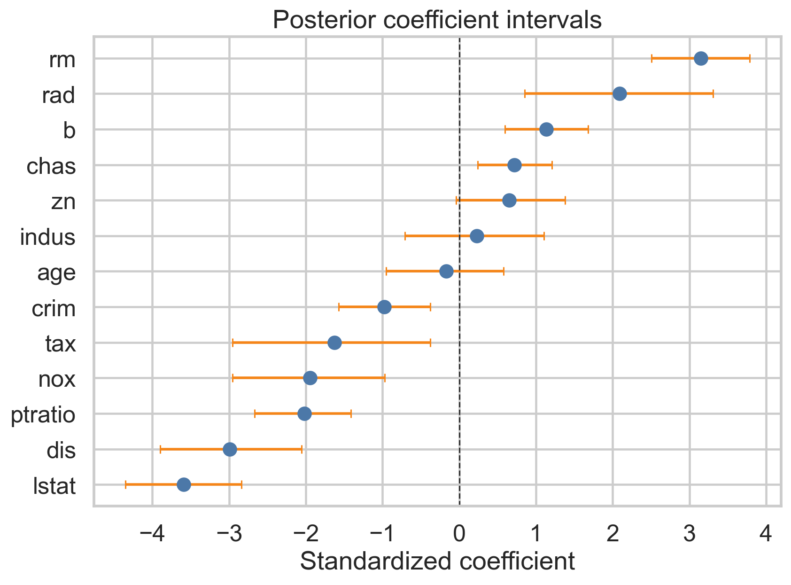
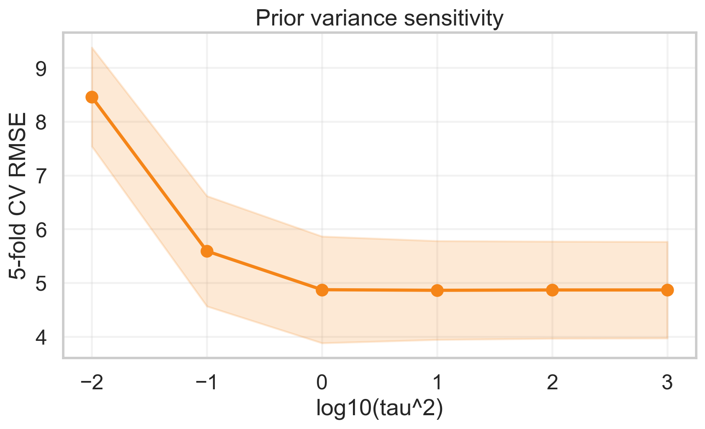
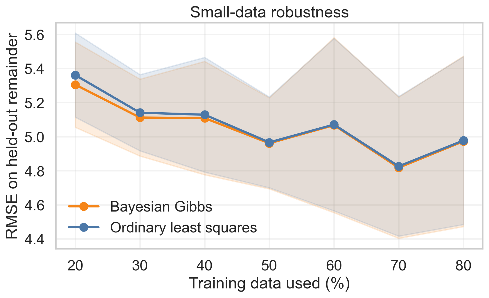
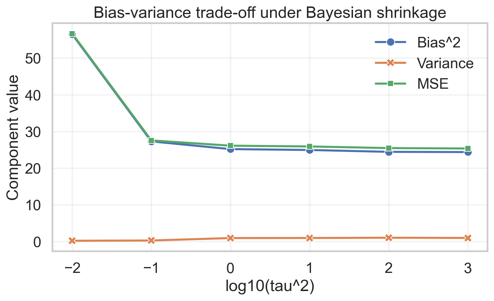
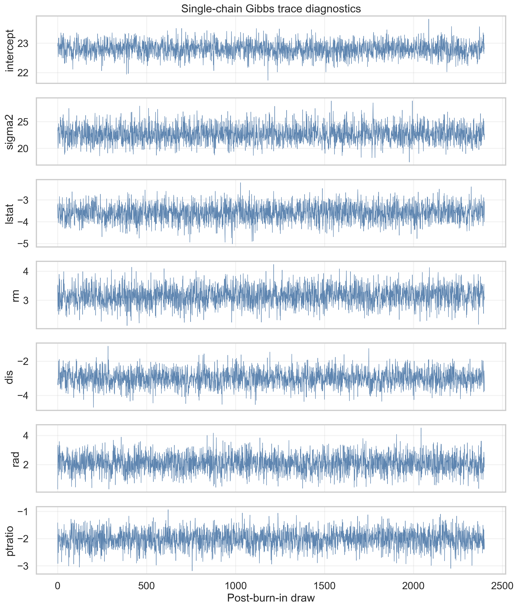
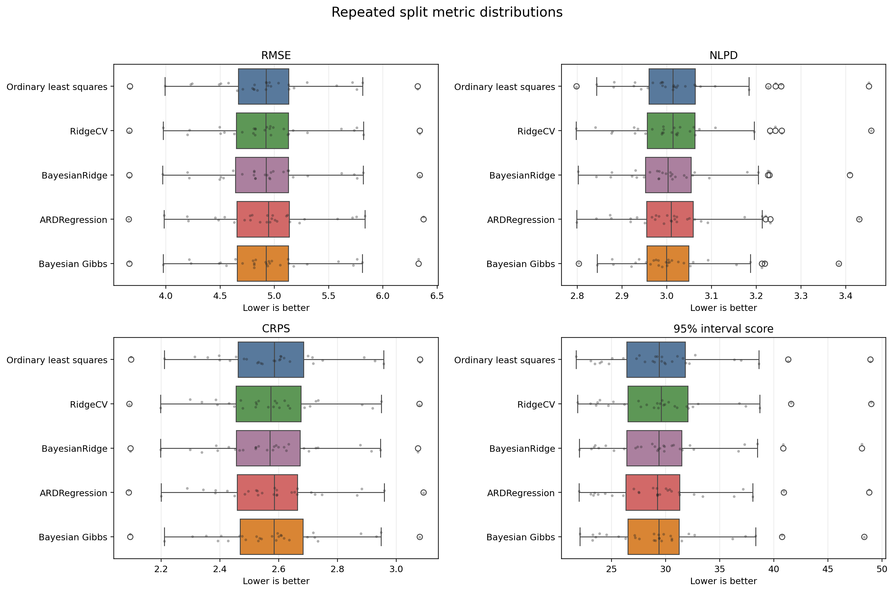
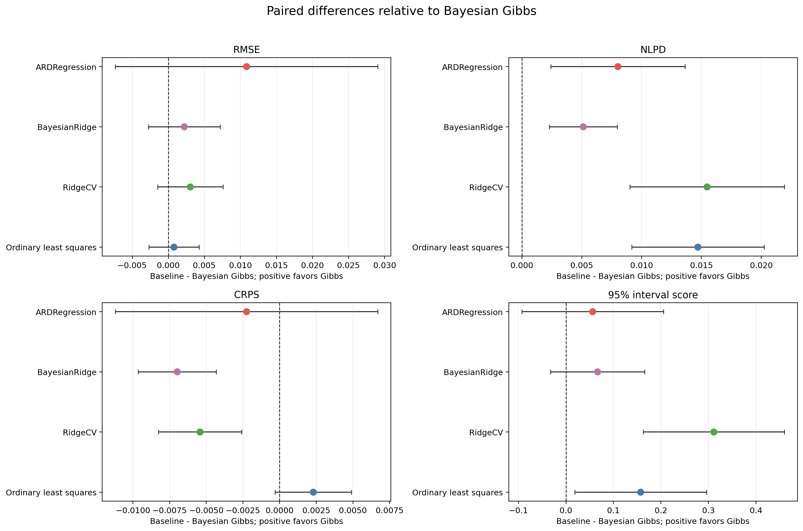

# Bayesian Methods Lab

Exploring Bayesian modeling, posterior inference, uncertainty quantification,
and robust prediction.

This repository is an exploratory research lab for Bayesian methods. The current
implemented study is **Part I: Bayesian Regression Foundations**, a reproducible
Boston Housing benchmark comparing ordinary least squares with Bayesian linear
regression and related linear baselines.

The project is intentionally growing in stages. Part I keeps the model class
simple so that posterior inference, prior sensitivity, uncertainty
quantification, and robustness can be studied before adding more advanced
Bayesian models.

## Research Question

For Part I, the guiding question is:

How much does Bayesian linear regression add beyond ordinary least squares when
the dataset is small, correlated, and uncertainty matters?

The current experiments compare point prediction, posterior uncertainty,
prior-variance sensitivity, small-data robustness, and the bias-variance
trade-off.

Future parts will extend the lab toward MCMC diagnostics, probabilistic scoring,
robust Bayesian regression, sparse priors, hierarchical models, Gaussian
processes or BART, and engineering-mathematics applications such as inverse
problems and Bayesian calibration.

## Part I: Bayesian Regression Foundations

The current benchmark preserves the original Boston Housing study and all
generated numeric results. It includes:

- ordinary least squares, RidgeCV, BayesianRidge, and ARDRegression baselines;
- a custom conjugate Bayesian linear regression Gibbs sampler;
- prior-variance tuning over `tau^2`;
- posterior coefficient intervals and posterior predictive intervals;
- small-data robustness experiments;
- bootstrap bias-variance decomposition;
- a sensitivity check for the legacy `b` feature in Boston Housing.

## Snapshot: Current Saved Results

The latest generated results use a fixed 80/20 train/test split, 5-fold
cross-validation on the training split to choose the Bayesian prior variance,
and standardized predictors. The selected Gibbs prior variance is `tau^2 = 10`.

| Model | RMSE | MAE | R2 | 95% coverage | NLPD | CRPS | 95% interval score |
| --- | ---: | ---: | ---: | ---: | ---: | ---: | ---: |
| Ordinary least squares | 4.940 | 3.206 | 0.667 | 94.1% | 3.018 | 2.482 | 32.724 |
| Bayesian Gibbs | 4.948 | 3.206 | 0.666 | 94.1% | 3.006 | 2.478 | 32.532 |
| BayesianRidge | 4.953 | 3.195 | 0.665 | 94.1% | 3.012 | 2.479 | 32.599 |
| RidgeCV | 4.956 | 3.193 | 0.665 | 94.1% | 3.021 | 2.478 | 32.998 |
| ARDRegression | 4.982 | 3.210 | 0.662 | 94.1% | 3.018 | 2.497 | 32.638 |

On the full held-out split, ordinary least squares and Bayesian Gibbs are
effectively tied on point prediction. The Bayesian model adds calibrated
posterior predictive intervals and is slightly more stable in repeated
small-data experiments: across 20%-80% training-size repeats, Bayesian Gibbs
reduces average RMSE by about 0.018, or 0.35%, relative to OLS.

This should be read carefully: the current single-split RMSE results do **not**
show that Bayesian regression outperforms OLS on point prediction. The stronger
claim supported here is that Bayesian regression gives comparable point accuracy
while adding posterior uncertainty, interval estimates, and a framework for
prior-sensitivity and robustness analysis.

The comparison table now reports probabilistic scores for all benchmark rows:
negative log predictive density (`nlpd`), continuous ranked probability score
(`crps`), and the 95% interval score (`interval_score_95`). Ordinary least
squares and RidgeCV use residual-normal predictive baselines estimated from
training residuals; these are not Bayesian posterior intervals. BayesianRidge
and ARDRegression use scikit-learn's predictive standard deviations. On this
single split, Bayesian Gibbs has the lowest NLPD and interval score, while CRPS
is essentially tied with RidgeCV and BayesianRidge. These results support
comparable point prediction plus useful uncertainty quantification, not a broad
claim that the Gibbs model dominates every baseline.

The benchmark also saves lightweight single-chain MCMC diagnostics for the
custom Gibbs sampler, including approximate effective sample size and selected
autocorrelations. These diagnostics are intended for inspecting mixing, not for
claiming formal convergence; multi-chain R-hat diagnostics are future work.

The `b` feature in Boston Housing is ethically problematic. A sensitivity run
that drops it improves the Bayesian Gibbs test RMSE from 4.951 to 4.791 and
raises 95% interval coverage from 94.1% to 96.1%. This is not a causal claim,
but it is a useful reminder that benchmark features need auditing.

## Figures
















## Repository Layout

```text
.
|-- BostonHousing_data.csv
|-- experiments/
|   |-- run_boston_benchmark.py
|   `-- run_repeated_split_comparison.py
|-- src/
|   `-- bayeslinreg/
|       |-- data.py
|       |-- diagnostics.py
|       |-- metrics.py
|       |-- models.py
|       `-- repeated_split.py
|-- reports/
|   |-- figures/
|   `-- tables/
|-- docs/
|   |-- dataset_note.md
|   |-- original_report_summary.md
|   |-- research_questions.md
|   `-- roadmap.md
|-- AGENTS.md
`-- tests/
    |-- test_bayeslinreg.py
    |-- test_diagnostics.py
    `-- test_repeated_split.py
```

## Reproduce

```bash
python -m venv .venv
source .venv/bin/activate
pip install -r requirements.txt
python experiments/run_boston_benchmark.py
python experiments/run_repeated_split_comparison.py
pytest -q
```

The main benchmark regenerates the fixed-split Part I tables and figures. The
repeated-split script regenerates the split-stability tables and figures. Use
`--n-repeats` on the repeated-split script for a faster local smoke run.

## Methodology

The benchmark includes five linear models:

| Family | Implementation | Purpose |
| --- | --- | --- |
| Ordinary least squares | `sklearn.linear_model.LinearRegression` | Classical point-estimate baseline |
| Ridge regression | `sklearn.linear_model.RidgeCV` | Frequentist shrinkage baseline |
| Empirical Bayes | `sklearn.linear_model.BayesianRidge` | Mainstream Python Bayesian baseline |
| Sparse empirical Bayes | `sklearn.linear_model.ARDRegression` | Automatic relevance determination baseline |
| Conjugate Bayesian Gibbs | `src/bayeslinreg/models.py` | Transparent sampler matching the original report |

The custom Gibbs sampler uses:

```text
y | X, beta, sigma^2 ~ Normal(X beta, sigma^2 I)
beta ~ Normal(0, V0)
sigma^2 ~ Inverse-Gamma(a0, b0)
```

The sampler alternates between closed-form draws of `beta | sigma^2, X, y` and
`sigma^2 | beta, X, y`. Posterior predictive intervals include both coefficient
uncertainty and residual noise.

## Result Artifacts

| File | Description |
| --- | --- |
| `reports/tables/model_comparison.csv` | Held-out RMSE, MAE, R2, interval coverage, NLPD, CRPS, and interval score |
| `reports/tables/tau_cv_summary.csv` | 5-fold CV prior-variance sweep |
| `reports/tables/posterior_coefficients.csv` | Posterior coefficient means and 95% intervals |
| `reports/tables/mcmc_diagnostics.csv` | Lightweight single-chain ESS and autocorrelation diagnostics |
| `reports/tables/repeated_split_raw.csv` | Per-split metrics for repeated random train/test comparisons |
| `reports/tables/repeated_split_summary.csv` | Repeated-split metric means, standard deviations, and 95% confidence intervals |
| `reports/tables/repeated_split_pairwise.csv` | Paired baseline-minus-Gibbs differences and Gibbs win rates |
| `reports/tables/training_size_summary.csv` | Repeated small-data robustness experiment |
| `reports/tables/bias_variance.csv` | Bootstrap bias-variance decomposition |
| `reports/tables/legacy_feature_sensitivity.csv` | Full legacy features vs dropping `b` |
| `reports/tables/test_predictions.csv` | Held-out Bayesian predictions and intervals |
| `reports/figures/mcmc_trace_diagnostics.png` | Trace plots for intercept, sigma2, and top coefficients |
| `reports/figures/repeated_split_metric_distributions.png` | Distributions of RMSE, NLPD, CRPS, and interval score across splits |
| `reports/figures/repeated_split_pairwise_differences.png` | Paired metric differences relative to Bayesian Gibbs |

## Dataset Note

Boston Housing is retained because it is the dataset used in the original
analysis and remains useful as a compact regression benchmark. It should not be
treated as a modern housing-policy dataset. The original `b` variable encodes a
racial-composition transform, and scikit-learn deprecated `load_boston` for
ethical reasons. See [`docs/dataset_note.md`](docs/dataset_note.md).

## Research Direction

Bayesian Methods Lab will grow through PR-sized research increments. The near
term direction is documented in:

- [`docs/research_questions.md`](docs/research_questions.md)
- [`docs/roadmap.md`](docs/roadmap.md)

Good next steps for the lab:

- compare Gibbs sampling with PyMC/NUTS or NumPyro/HMC;
- add hierarchical priors, horseshoe shrinkage, and robust likelihoods;
- evaluate beyond Boston Housing on modern tabular regression datasets;
- use PSIS-LOO, WAIC, and calibrated predictive log scores, not only RMSE.

## References

- scikit-learn, [BayesianRidge](https://scikit-learn.org/stable/modules/generated/sklearn.linear_model.BayesianRidge.html)
  and [ARDRegression](https://scikit-learn.org/stable/modules/generated/sklearn.linear_model.ARDRegression.html).
- scikit-learn example,
  [Comparing Linear Bayesian Regressors](https://scikit-learn.org/stable/auto_examples/linear_model/plot_ard.html).
- scikit-learn legacy documentation,
  [`load_boston` deprecation note](https://scikit-learn.org/1.1/modules/generated/sklearn.datasets.load_boston.html).
- Harrison, D. and Rubinfeld, D. L. (1978).
  [Hedonic housing prices and the demand for clean air](https://doi.org/10.1016/0095-0696(78)90006-2).
