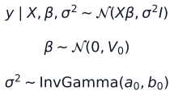
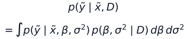
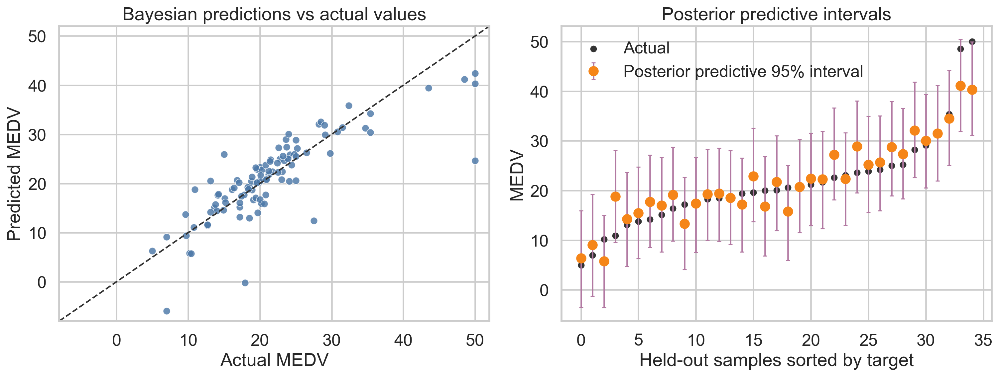
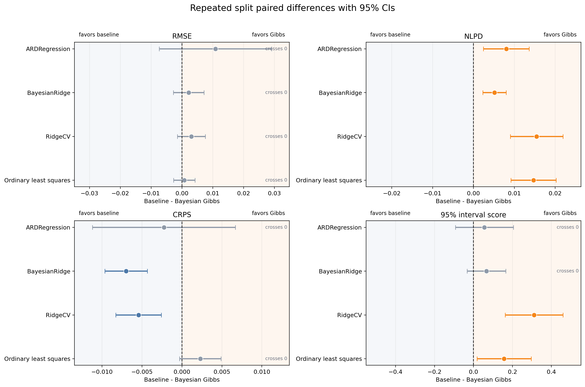
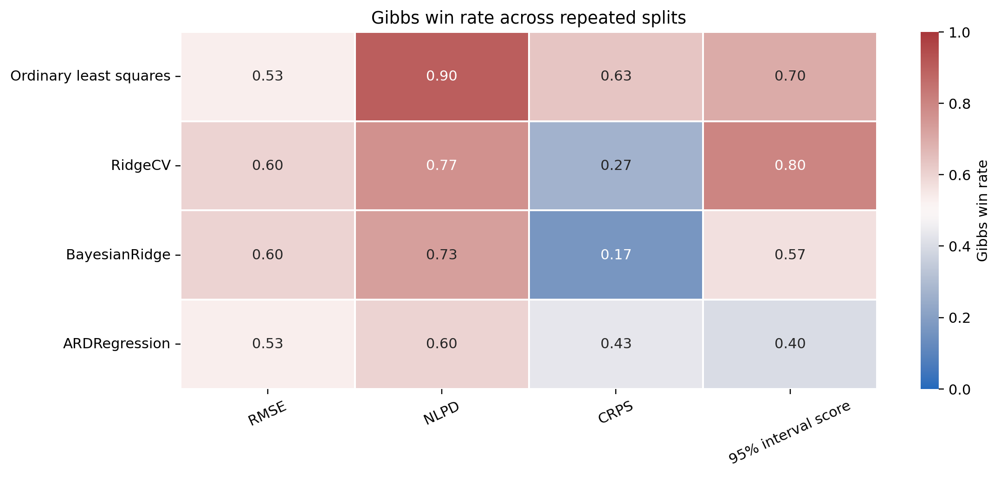

# Bayesian Methods Lab

Bayesian Methods Lab is a Python research workspace for studying Bayesian
modeling, posterior inference, uncertainty quantification, and robust
prediction. The repository is organized as a sequence of research parts. Each
part keeps its detailed question, methods, equations, experiments, figures, and
interpretation in `docs/`, while this README stays as the lab index.

## Research Directory

| Part | Theme | Status | Research Entry |
| --- | --- | --- | --- |
| I | Bayesian Regression Foundations | Current | [Part I report](docs/part1_bayesian_regression_foundations.md) |
| II | Probabilistic Inference Engines | Planned | Compare custom Gibbs with PyMC/NUTS or related HMC workflows |
| III | Robust And Sparse Regression | Planned | Study Student-t likelihoods, sparse priors, and outlier robustness |
| IV | Hierarchical And Nonparametric Models | Planned | Extend to grouped data, Gaussian processes, and BART-style models |
| V | Engineering-Mathematics Applications | Planned | Explore Bayesian calibration, inverse problems, and simulation uncertainty |

The current repository implements Part I. Later parts should be added as new
documents and experiments without turning the README into a full report.

## Current Study

**Part I: Bayesian Regression Foundations** asks what posterior inference adds
beyond ordinary least squares on a compact tabular regression benchmark.

| Component | Part I Design |
| --- | --- |
| Dataset | Legacy Boston Housing, with an explicit ethical note |
| Models | OLS, RidgeCV, BayesianRidge, ARDRegression, custom Bayesian Gibbs |
| Inference focus | Posterior coefficients, residual variance, and posterior predictive samples |
| Scores | RMSE, MAE, R2, coverage, NLPD, CRPS, 95% interval score |
| Stability check | 30 repeated train/test splits with paired differences |
| Diagnostics | Lightweight single-chain ESS, autocorrelation, and trace plots |

The central Bayesian object is the posterior predictive distribution. Equation
assets are rendered as SVG images so that GitHub displays them reliably without
unsupported README math macros.





## Current Findings

| Research Question | Evidence So Far | Interpretation |
| --- | --- | --- |
| Does Gibbs improve point prediction? | Repeated-split RMSE confidence intervals cross zero against every baseline | No stable RMSE advantage |
| Does posterior prediction improve density scoring? | Repeated-split NLPD favors Bayesian Gibbs | Gibbs assigns better predictive density in this benchmark |
| Does Gibbs dominate all probabilistic scores? | CRPS favors RidgeCV and BayesianRidge; interval score is mixed | No broad dominance claim is supported |
| Why keep the Bayesian model? | It provides posterior uncertainty, predictive intervals, and inspectable samples | Valuable as an uncertainty-aware research baseline |

The safest conclusion is deliberately narrow: Bayesian Gibbs is competitive on
point prediction and useful for posterior uncertainty and predictive density,
but the current evidence does not show a general RMSE improvement over OLS.

## Key Visual Evidence

### 1. Posterior Predictive Uncertainty

This figure answers what the Bayesian model adds beyond a fitted mean. Each
held-out prediction is shown with a posterior predictive interval, combining
coefficient uncertainty and residual noise.



The intervals make uncertainty visible even when point metrics are nearly tied.
This is the main practical reason to keep the custom Gibbs sampler as the first
Bayesian baseline.

### 2. Repeated-Split Paired Evidence

This forest plot answers whether single-split differences are stable. The x-axis
is baseline metric minus Gibbs metric; for lower-is-better scores, positive
values favor Gibbs. Confidence intervals crossing zero indicate unstable or
inconclusive differences.



The result is mixed: RMSE is not stable, NLPD favors Gibbs, CRPS favors
RidgeCV/BayesianRidge, and interval score depends on the baseline.

### 3. Gibbs Win Rates

This heatmap gives a compact view of how often Gibbs wins across repeated
splits and metrics.



It reinforces the same interpretation: Gibbs often wins on NLPD, but not
consistently on RMSE or CRPS.

## How To Navigate The Lab

| Need | Go To |
| --- | --- |
| Full Part I research narrative | [docs/part1_bayesian_regression_foundations.md](docs/part1_bayesian_regression_foundations.md) |
| Future research themes | [docs/research_questions.md](docs/research_questions.md) |
| PR-sized milestone plan | [docs/roadmap.md](docs/roadmap.md) |
| Dataset ethics and benchmark caveats | [docs/dataset_note.md](docs/dataset_note.md) |

## Reproduce

```bash
python -m venv .venv
source .venv/bin/activate
pip install -r requirements.txt
python scripts/render_equation_assets.py
python experiments/run_boston_benchmark.py
python experiments/run_repeated_split_comparison.py
pytest -q
```

Use `--n-repeats` with `experiments/run_repeated_split_comparison.py` for a
faster repeated-split smoke run.

## Development Notes

- Keep the Python package name `bayeslinreg` until a dedicated package-rename
  PR is planned.
- Keep generated tables in `reports/tables/` and figures in `reports/figures/`.
- Add future work as new research parts with concise README links and detailed
  documents under `docs/`.
- Avoid strong claims unless repeated-split or external-benchmark evidence
  supports them.

## References

- scikit-learn,
  [BayesianRidge](https://scikit-learn.org/stable/modules/generated/sklearn.linear_model.BayesianRidge.html)
  and
  [ARDRegression](https://scikit-learn.org/stable/modules/generated/sklearn.linear_model.ARDRegression.html).
- scikit-learn example,
  [Comparing Linear Bayesian Regressors](https://scikit-learn.org/stable/auto_examples/linear_model/plot_ard.html).
- Harrison, D. and Rubinfeld, D. L. (1978).
  [Hedonic housing prices and the demand for clean air](https://doi.org/10.1016/0095-0696(78)90006-2).
