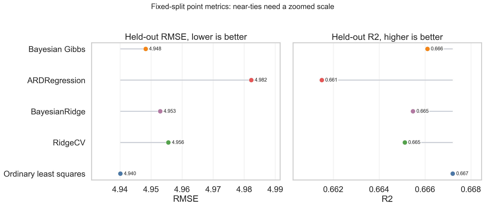
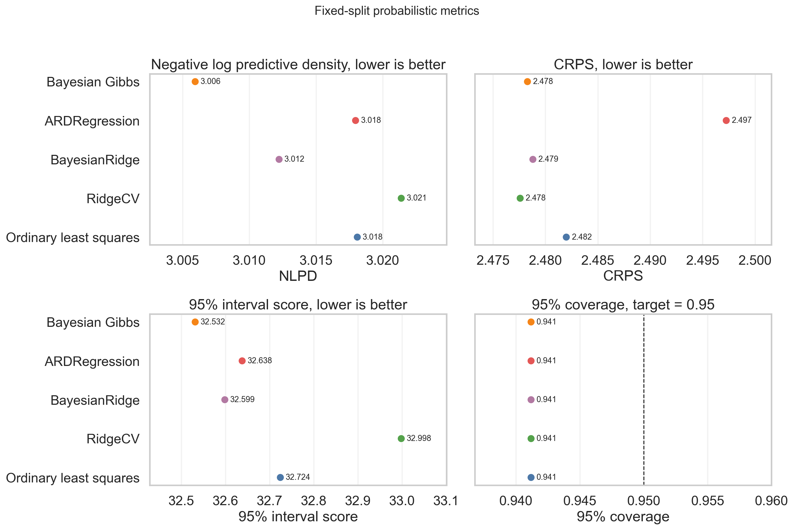

# Part I: Bayesian Predictive Foundations for Uncertainty-Aware AI

## Abstract

Part I consolidates the laboratory's earlier Bayesian regression work and
establishes the methodological standard for the subsequent study of reliable
language, multimodal, and agentic AI systems. A controlled Boston Housing
benchmark is used to compare ordinary least squares, regularized regression,
empirical Bayes estimators, and a custom Gibbs sampler. The purpose is not to
claim that Bayesian inference universally improves point prediction. Instead,
the study demonstrates how a predictive distribution can be constructed,
diagnosed, compared with proper scoring rules, and interpreted without reducing
uncertainty to a single accuracy number. Across thirty repeated train--test
splits, the custom Gibbs model does not show a stable RMSE advantage over the
baselines. Its principal value is the availability of posterior samples,
predictive intervals, and competitive predictive-density scores. These lessons
provide the statistical bridge from conventional regression uncertainty to the
later modelling of hallucination as a calibrated posterior risk.

## Position in the Research Programme

The research programme begins with [Part 0](../part0_reproductions/README.md),
which reproduces and audits published uncertainty methods. Part I then provides
a transparent setting in which posterior inference, calibration, repeated
evaluation, and cautious interpretation can be studied before introducing the
semantic, multimodal, and sequential complexity of generative AI.

The conceptual transition is direct. In this benchmark, the object of interest
is a posterior predictive distribution for an unknown continuous response. In
Part II, the object becomes a posterior probability that a generated claim is
hallucinated. Parts III and IV will extend that risk across modalities and use
it to choose actions. The common principle is that reliable decisions should be
based on a predictive distribution and an explicit loss, rather than on an
uncalibrated score or a point prediction alone.

```text
Published uncertainty signals (Part 0)
                    |
                    v
Posterior prediction and evaluation (Part I)
                    |
                    v
Calibrated hallucination risk (Part II)
                    |
                    v
Typed multimodal risk (Part III)
                    |
                    v
Sequential agent decisions (Part IV)
```

## Research Question

The controlled research question is:

> What measurable value does Bayesian posterior prediction add beyond ordinary
> point estimation when data are limited, predictors are correlated, and
> uncertainty must support a decision?

This question is divided into three empirical tests. First, does the Gibbs model
improve point-prediction metrics such as RMSE? Second, does its posterior
predictive distribution improve proper probabilistic scores or interval
quality? Third, are any apparent differences stable across repeated data
splits? This separation prevents an improvement in one property from being
misreported as general superiority.

## Data and Ethical Scope

The study retains the Boston Housing dataset because it was used in the
original research report and provides a compact benchmark with 506 observations
and 13 predictors. The response `medv` is the median value of owner-occupied
homes in thousands of US dollars in the historical dataset.

The dataset is not suitable as a contemporary housing-policy benchmark. Its
legacy `b` variable encodes a racial-composition transform and is ethically
problematic. A sensitivity experiment therefore compares the full feature set
with a screened set that removes `b`. The dataset is retained only for
reproducibility and methodological continuity; new applied studies should use
modern, documented datasets. Further context is provided in the [dataset
note](dataset_note.md).

## Bayesian Model

Let (n) be the number of training observations and (p) the number of
predictors. Let

- (\mathbf y=(y_1,\ldots,y_n)^\top\in\mathbb R^n) denote the observed response;
- (X\in\mathbb R^{n\times(p+1)}) denote the design matrix, including an
  intercept column;
- (\boldsymbol\beta\in\mathbb R^{p+1}) denote the intercept and regression
  coefficients;
- (\sigma^2>0) denote the residual variance;
- (V_0\in\mathbb R^{(p+1)\times(p+1)}) denote the prior covariance matrix;
- (a_0) and (b_0) denote the inverse-gamma hyperparameters.

The written model is

```math
\begin{aligned}
\mathbf y\mid X,\boldsymbol\beta,\sigma^2
&\sim
\mathcal N\!\left(X\boldsymbol\beta,\sigma^2I_n\right),\\[3pt]
\boldsymbol\beta
&\sim
\mathcal N\!\left(\mathbf 0,V_0\right),\\[3pt]
\sigma^2
&\sim
\operatorname{InvGamma}(a_0,b_0).
\end{aligned}
```

The likelihood states that each observation fluctuates around the linear mean
(X\boldsymbol\beta) with Gaussian residual variance (\sigma^2). The Gaussian
prior shrinks coefficients toward zero, with the diagonal elements of (V_0)
controlling the strength of that shrinkage. The inverse-gamma prior constrains
the residual variance to be positive and supplies a conjugate form for Gibbs
updates.

For a coefficient prior variance (\tau^2), the implementation uses a diffuse
intercept prior and a common prior variance for the standardized feature
coefficients. A small (\tau^2) imposes strong shrinkage; a large (\tau^2)
approaches a weakly regularized regression. Five-fold cross-validation over

```math
\tau^2\in\{0.01,0.1,1,10,100,1000\}
```

selects (\tau^2=10) for the main experiment.

The sampler alternates draws from the conditional distributions of
(\boldsymbol\beta) and (\sigma^2). If (s=1,\ldots,S) indexes retained
post-burn-in draws, the resulting samples are

```math
\left\{
\boldsymbol\beta^{(s)},\sigma^{2(s)}
\right\}_{s=1}^{S}.
```

These draws preserve joint parameter uncertainty and can be propagated into
future predictions. Before any paper-style release, the documented prior and
the implemented conditional update for (\sigma^2) should be audited for exact
mathematical consistency. The present report preserves the original sampler and
saved numerical results rather than silently changing the model.

## Posterior Predictive Distribution

For a new standardized predictor vector (\widetilde{\mathbf x}\) and unknown
response (\widetilde y), the posterior predictive distribution is

```math
p(\widetilde y\mid\widetilde{\mathbf x},D)
=
\int
p(\widetilde y\mid\widetilde{\mathbf x},\boldsymbol\beta,\sigma^2)
p(\boldsymbol\beta,\sigma^2\mid D)
\,d\boldsymbol\beta\,d\sigma^2,
```

where (D=(X,\mathbf y)) denotes the observed training data. The first factor
inside the integral represents residual or aleatoric variation conditional on
parameters. The second factor represents posterior uncertainty about those
parameters. Integrating both sources produces a distribution over possible
future values rather than a single fitted mean.

Monte Carlo prediction uses

```math
\widetilde y^{(s)}
=
\widetilde{\mathbf x}^{\top}\boldsymbol\beta^{(s)}
+
\varepsilon^{(s)},
\qquad
\varepsilon^{(s)}\sim\mathcal N\!\left(0,\sigma^{2(s)}\right).
```

The sample mean estimates the posterior predictive expectation, while empirical
quantiles form predictive intervals.


This is the central methodological lesson for later parts of the programme. A
hallucination detector should likewise produce a posterior distribution over
risk, propagate uncertainty in its parameters and evidence, and expose that
uncertainty to the downstream decision rule.

## Models and Evaluation Protocol

Five models are compared under a common 80/20 split with random seed 42:

| Model | Implementation | Predictive role |
| --- | --- | --- |
| Ordinary least squares | `LinearRegression` | Unregularized point baseline with residual-normal predictive approximation |
| RidgeCV | `RidgeCV` | Regularized frequentist baseline with residual-normal predictive approximation |
| BayesianRidge | scikit-learn | Empirical Bayes baseline with predictive standard deviation |
| ARDRegression | scikit-learn | Sparse empirical Bayes baseline |
| Bayesian Gibbs | `bayeslinreg` | Joint posterior samples and Monte Carlo posterior prediction |

Point predictions are assessed with RMSE, MAE, and (R^2). Predictive
distributions are assessed with coverage, interval width, negative log
predictive density (NLPD), continuous ranked probability score (CRPS), and the
95% interval score. Lower NLPD, CRPS, and interval score are better.

For test observations ((x_i,y_i)_{i=1}^{n_*}), NLPD is

```math
\operatorname{NLPD}
=
-\frac{1}{n_*}
\sum_{i=1}^{n_*}
\log p(y_i\mid x_i,D).
```

Here (n_*) is the number of test observations and
(p(y_i\mid x_i,D)) is the predictive density assigned to the observed outcome.
Unlike RMSE, NLPD penalizes a model that is accurate on average but expresses
an unjustifiably narrow or misplaced predictive distribution.

For a central interval ([l_i,u_i]) with miscoverage level (\alpha=0.05), the
interval score is

```math
\operatorname{IS}_{\alpha}(l_i,u_i;y_i)
=
(u_i-l_i)
+\frac{2}{\alpha}(l_i-y_i)\mathbb I(y_i<l_i)
+\frac{2}{\alpha}(y_i-u_i)\mathbb I(y_i>u_i),
```

where (l_i) and (u_i) are the lower and upper predictive bounds and
(\mathbb I(\cdot)) is an indicator function. The score rewards narrow
intervals but imposes a large penalty when the observation falls outside them.

## Fixed-Split Results

| Model | RMSE | MAE | (R^2) | Coverage 95% | NLPD | CRPS | Interval score 95% |
| --- | ---: | ---: | ---: | ---: | ---: | ---: | ---: |
| Ordinary least squares | 4.940 | 3.206 | 0.667 | 0.941 | 3.018 | 2.482 | 32.724 |
| RidgeCV | 4.956 | 3.193 | 0.665 | 0.941 | 3.021 | 2.478 | 32.998 |
| BayesianRidge | 4.953 | 3.195 | 0.665 | 0.941 | 3.012 | 2.479 | 32.599 |
| ARDRegression | 4.982 | 3.210 | 0.661 | 0.941 | 3.018 | 2.497 | 32.638 |
| Bayesian Gibbs | 4.948 | 3.206 | 0.666 | 0.941 | 3.006 | 2.478 | 32.532 |

The point metrics are effectively tied. OLS has the lowest fixed-split RMSE,
while the Gibbs model has the lowest NLPD and interval score. CRPS is nearly
identical for RidgeCV, BayesianRidge, and Gibbs. A single split therefore
suggests possible predictive-density value but does not justify a general
superiority claim.





## Repeated-Split Evidence

The stability analysis repeats the 80/20 split thirty times with deterministic
seeds. For comparison model (m), metric (L), and split (s), the paired
difference relative to Gibbs is

```math
\Delta_{m,s}
=
L_{m,s}-L_{\mathrm{Gibbs},s},
\qquad
\overline{\Delta}_m
=
\frac{1}{S}\sum_{s=1}^{S}\Delta_{m,s},
```

where (S=30). For lower-is-better metrics, a positive value favours Gibbs.
Pairing removes between-split variation from the comparison because both models
are evaluated on the same training and test observations.

| Model | Mean RMSE | Mean NLPD | Mean CRPS | Mean interval score 95% |
| --- | ---: | ---: | ---: | ---: |
| Ordinary least squares | 4.925 | 3.030 | 2.579 | 30.089 |
| RidgeCV | 4.927 | 3.031 | 2.571 | 30.243 |
| BayesianRidge | 4.926 | 3.021 | 2.570 | 29.999 |
| ARDRegression | 4.935 | 3.023 | 2.575 | 29.988 |
| Bayesian Gibbs | 4.924 | 3.015 | 2.577 | 29.932 |

The 95% confidence intervals for paired RMSE differences cross zero for every
baseline. Repeated-split NLPD favours Gibbs against the present baselines, while
CRPS favours RidgeCV and BayesianRidge. Interval-score evidence favours Gibbs
against OLS and RidgeCV but is mixed against the empirical Bayes models. The
choice of proper score therefore changes the comparison, which is precisely why
future hallucination-risk work must report more than AUROC or accuracy.


## Posterior Diagnostics

The saved Gibbs run contains 2,400 post-burn-in draws. Lightweight diagnostics
include lagged autocorrelation and a single-chain effective sample-size
approximation. The smallest reported ESS is approximately 1,881 for `dis`, and
the largest lag-1 autocorrelation is approximately 0.044. These values do not
suggest obvious mixing failure in the saved chain, but they are not formal
convergence evidence. Multiple chains, rank-normalized (\widehat R), and more
robust posterior predictive checks remain necessary for a publication-grade
Bayesian analysis.


## Findings and Methodological Lessons

The benchmark supports four conclusions. First, posterior inference does not
automatically improve point accuracy: the observed RMSE differences are small
and unstable. Second, probabilistic value is metric-dependent: Gibbs performs
well on NLPD but does not dominate CRPS. Third, uncertainty claims require
diagnostics and repeated comparisons, not one attractive interval plot. Fourth,
the output required for a decision is a predictive distribution, whereas a
point estimate or raw uncertainty score is insufficient.

These conclusions define the standard for subsequent AI studies. A future
hallucination-risk model should be evaluated with binary NLL and Brier score,
calibration curves, discrimination metrics, risk--coverage, subgroup analysis,
and repeated or hierarchical comparisons across models and datasets. It should
also distinguish the quality of the risk estimate from the utility of the
decision made with that estimate.

## Bridge to Posterior Hallucination Risk

Let (H_i\in\{0,1\}) denote whether generated item (i) is hallucinated and let
(z_i) collect observed uncertainty and evidence signals. The first Part II
target is

```math
r_i
=
P(H_i=1\mid z_i,x_i,m_i,d_i,D),
```

where (x_i) is the prompt and grounding context, (m_i) is the model identity,
(d_i) is the task or domain, and (D) is the calibration dataset. The raw
signals in (z_i) are analogous to predictors in Part I; they are not themselves
the target probability.

Later, an action (a\) will be selected by

```math
a_i^*
=
\arg\min_{a\in\mathcal A}
\mathbb E\!\left[L(a,H_i)\mid z_i,x_i,m_i,d_i,D\right],
```

where (\mathcal A) may include answer, abstain, clarify, retrieve, verify,
regenerate, consult another agent, or request human review, and (L(a,H_i))
encodes the cost of action (a) under the unknown hallucination state. This is
the point at which calibrated uncertainty becomes adaptive behaviour.

## Limitations

The benchmark is based on a small legacy dataset and a linear Gaussian model.
Residual-normal approximations for OLS and RidgeCV are convenient rather than
fully Bayesian. The Gibbs implementation currently uses one chain, the written
prior and implemented conditionals require a dedicated consistency audit, and
the repeated-split experiment does not replace external validation. Most
importantly, regression uncertainty does not capture semantic equivalence,
factual evidence, label noise, multimodal grounding, model shift, or temporal
error propagation. These are research targets for Parts 0 and II--IV, not
properties established by Part I.

## Reproduction

```bash
python -m venv .venv
source .venv/bin/activate
pip install -r requirements.txt
python experiments/run_boston_benchmark.py
python experiments/run_repeated_split_comparison.py
pytest -q
```

Use `--n-repeats` with the repeated-split runner for a shorter smoke test. The
saved tables and figures used above are catalogued in [artifacts.md](artifacts.md).

## References

- Harrison, D. and Rubinfeld, D. L. (1978). [Hedonic housing prices and the
  demand for clean air](https://doi.org/10.1016/0095-0696(78)90006-2).
- scikit-learn, [BayesianRidge](https://scikit-learn.org/stable/modules/generated/sklearn.linear_model.BayesianRidge.html)
  and [ARDRegression](https://scikit-learn.org/stable/modules/generated/sklearn.linear_model.ARDRegression.html).
- Vashurin et al. (2025). [Benchmarking Uncertainty Quantification Methods for
  Large Language Models with LM-Polygraph](https://aclanthology.org/2025.tacl-1.11/).
- Wang and Holmes (2025). [On Subjective Uncertainty Quantification and
  Calibration in Natural Language Generation](https://proceedings.mlr.press/v258/wang25i.html).
