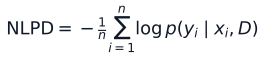

# Part I: Bayesian Regression Foundations

Part I turns the original Boston Housing Bayesian linear regression coursework
into a reproducible Python research benchmark. The goal is to compare ordinary
point prediction with Bayesian posterior prediction while keeping the model
simple enough to inspect.

## Research Question

How much does Bayesian linear regression add beyond ordinary least squares when
the dataset is small, correlated, and uncertainty matters?

The benchmark evaluates three related questions:

- Does Bayesian Gibbs improve point-prediction metrics such as RMSE?
- Do posterior predictive distributions improve probabilistic scores?
- Are any observed differences stable across repeated train/test splits?

## Dataset And Ethical Note

The benchmark uses the legacy Boston Housing dataset because it is the dataset
used in the original project and remains a compact regression benchmark. It is
not a modern housing-policy dataset. The `b` feature encodes a racial
composition transform, and the repository includes a sensitivity analysis that
drops this feature. See [dataset_note.md](dataset_note.md) for context.

## Models Compared

| Model | Implementation | Role |
| --- | --- | --- |
| Ordinary least squares | `sklearn.linear_model.LinearRegression` | Classical point-estimate baseline |
| RidgeCV | `sklearn.linear_model.RidgeCV` | Frequentist shrinkage baseline |
| BayesianRidge | `sklearn.linear_model.BayesianRidge` | Empirical Bayes baseline with predictive standard deviations |
| ARDRegression | `sklearn.linear_model.ARDRegression` | Sparse empirical Bayes baseline |
| Bayesian Gibbs | `src/bayeslinreg/models.py` | Custom conjugate Gibbs sampler |

OLS and RidgeCV use residual-normal predictive baselines for distributional
scores. BayesianRidge and ARDRegression use scikit-learn predictive standard
deviations. Bayesian Gibbs uses posterior predictive samples.

## Bayesian Model Formulation

The custom Gibbs sampler uses a conjugate Bayesian linear regression model:

The sampler alternates between closed-form conditional draws of coefficients
and residual variance. Posterior predictive samples then integrate over the
joint posterior:

This is the main methodological difference from OLS: the model produces a
predictive distribution, not only a fitted mean.

## Experimental Design

The fixed-split benchmark uses:

- 80/20 train/test split with random seed `42`;
- standardized predictors;
- 5-fold cross-validation on the training split to select the Gibbs prior
  variance;
- selected Gibbs prior variance `tau2 = 10`;
- generated tables under `reports/tables/`;
- generated figures under `reports/figures/`.

The repeated-split comparison uses:

- 30 deterministic random 80/20 train/test splits;
- fixed Gibbs `tau2 = 10` from the main benchmark;
- paired baseline-minus-Gibbs differences for each metric.

## Fixed-Split Results

| Model | RMSE | MAE | R2 | Coverage 95 | NLPD | CRPS | Interval Score 95 |
| --- | ---: | ---: | ---: | ---: | ---: | ---: | ---: |
| Ordinary least squares | 4.940 | 3.206 | 0.667 | 0.941 | 3.018 | 2.482 | 32.724 |
| RidgeCV | 4.956 | 3.193 | 0.665 | 0.941 | 3.021 | 2.478 | 32.998 |
| BayesianRidge | 4.953 | 3.195 | 0.665 | 0.941 | 3.012 | 2.479 | 32.599 |
| ARDRegression | 4.982 | 3.210 | 0.661 | 0.941 | 3.018 | 2.497 | 32.638 |
| Bayesian Gibbs | 4.948 | 3.206 | 0.666 | 0.941 | 3.006 | 2.478 | 32.532 |

The fixed split shows near-tied point prediction. OLS has the lowest RMSE, but
Bayesian Gibbs is very close. Gibbs has the lowest NLPD and interval score on
this split, while CRPS is effectively tied with RidgeCV and BayesianRidge.

## Probabilistic Scoring

Part I evaluates predictive distributions with proper scoring metrics. Negative
log predictive density is:

Lower NLPD rewards predictive distributions that assign higher probability to
observed targets. CRPS and interval score evaluate distributional calibration
and sharpness from complementary angles.

## Repeated-Split Results

The repeated-split experiment tests whether differences from one split remain
stable across 30 random splits.

| Model | Mean RMSE | Mean NLPD | Mean CRPS | Mean Interval Score 95 |
| --- | ---: | ---: | ---: | ---: |
| Ordinary least squares | 4.925 | 3.030 | 2.579 | 30.089 |
| RidgeCV | 4.927 | 3.031 | 2.571 | 30.243 |
| BayesianRidge | 4.926 | 3.021 | 2.570 | 29.999 |
| ARDRegression | 4.935 | 3.023 | 2.575 | 29.988 |
| Bayesian Gibbs | 4.924 | 3.015 | 2.577 | 29.932 |

Paired differences are computed as:

For lower-is-better metrics, positive values favor Gibbs. The 95% confidence
intervals show:

- RMSE differences cross zero for every baseline;
- NLPD favors Gibbs against every baseline;
- CRPS favors RidgeCV and BayesianRidge over Gibbs;
- interval score favors Gibbs against OLS and RidgeCV, but is mixed against
  BayesianRidge and ARDRegression.

## MCMC Diagnostics

The repository includes lightweight single-chain diagnostics for the custom
Gibbs sampler. These diagnostics include posterior mean, posterior standard
deviation, approximate effective sample size, and autocorrelation at selected
lags.

The lowest approximate ESS in the saved diagnostics is about `1881` for `dis`.
The highest lag-1 autocorrelation is about `0.044`, also for `dis`. These values
suggest reasonable single-chain mixing for this experiment, but they do not
constitute formal convergence evidence. Multi-chain R-hat remains future work.

## Interpretation

The most defensible Part I conclusion is narrow:

- Bayesian Gibbs does not show a stable RMSE advantage over OLS or other linear
  baselines.
- Bayesian Gibbs provides posterior predictive uncertainty and performs well on
  NLPD across repeated splits.
- CRPS does not support broad Gibbs dominance.
- Interval-score evidence depends on the baseline.
- The value of the Bayesian model here is uncertainty-aware prediction and a
  transparent posterior inference workflow, not universal point-prediction
  improvement.

## Limitations

- Boston Housing is a small legacy benchmark with ethical limitations.
- Repeated splits reduce split dependence but do not replace evaluation on
  modern external datasets.
- OLS and RidgeCV probabilistic scores rely on residual-normal baseline
  assumptions.
- The custom Gibbs sampler currently uses one chain; formal multi-chain
  convergence diagnostics are future work.
- The likelihood is Gaussian, so heavy-tailed or outlier-robust behavior is not
  yet modeled.

## Next Steps

- Use Part I as the uncertainty-aware baseline for later Bayesian risk models.
- Move next toward Bayesian hallucination-risk modeling for language systems.
- Reuse the Part I evaluation discipline: probabilistic scores, calibration,
  repeated comparisons, and cautious interpretation.
- Extend from scalar regression uncertainty to binary and structured risk
  estimation for AI-system outputs.

## References

- scikit-learn,
  [BayesianRidge](https://scikit-learn.org/stable/modules/generated/sklearn.linear_model.BayesianRidge.html)
  and
  [ARDRegression](https://scikit-learn.org/stable/modules/generated/sklearn.linear_model.ARDRegression.html).
- scikit-learn example,
  [Comparing Linear Bayesian Regressors](https://scikit-learn.org/stable/auto_examples/linear_model/plot_ard.html).
- Harrison, D. and Rubinfeld, D. L. (1978).
  [Hedonic housing prices and the demand for clean air](https://doi.org/10.1016/0095-0696(78)90006-2).
