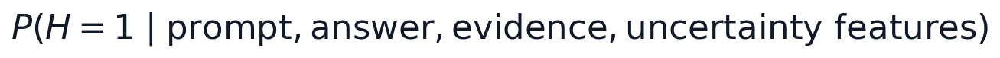
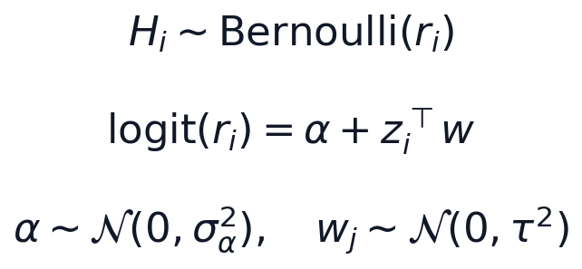
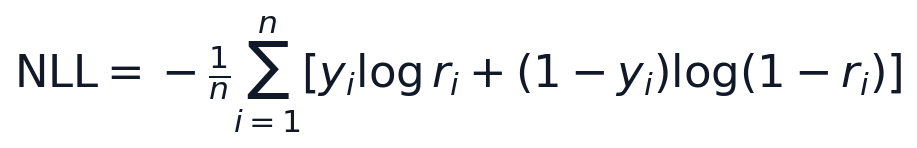
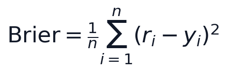

# Part II: Bayesian Hallucination Risk Modeling

Part II is a documentation scaffold for the next research direction. It does
not add hallucination datasets, multimodal code, or new Bayesian inference
implementations yet.

## Research Question

Can Bayesian risk modeling estimate calibrated hallucination probabilities for
language-model answers?

## Motivation

Part I studied posterior predictive uncertainty for regression. Part II
transfers that idea to language-model reliability: instead of predicting a
continuous target, the model estimates whether an answer is hallucinated.

The target is not only a binary detector. The goal is a calibrated posterior
risk estimate that can later support abstention, verification, regeneration, or
human review.

## Target Quantity

The Bayesian hallucination-risk score is:

Here `H = 1` means the answer is hallucinated or unsupported. The conditioning
information includes the prompt, answer, available evidence, and uncertainty
features extracted from generation or verification. The target is a calibrated
posterior risk, not just a hard hallucination label.

## First Bayesian Model

The first model should be intentionally simple, like Part I:

Here `z_i` contains uncertainty, consistency, and evidence features. Posterior
samples over `alpha` and `w` induce uncertainty over hallucination risk. This
keeps calibration and interpretation inspectable before moving to multimodal
systems.

## Candidate Evidence Features

Initial text-only features should be transparent and reproducible:

- token or sequence uncertainty;
- self-consistency disagreement;
- semantic disagreement across sampled answers;
- retrieval support score;
- verifier or judge score;
- answer length;
- claim count;
- contradiction or entailment score from an evidence checker.

## Evaluation Metrics

Part II should evaluate probabilistic risk estimates, not only binary accuracy.
Binary NLL is the classification analogue of NLPD from Part I:

Brier score measures squared probability error and is useful for calibration:

Candidate metrics include:

| Metric | Purpose |
| --- | --- |
| Negative log likelihood / binary NLPD | Rewards calibrated probability assigned to the observed hallucination label |
| Brier score | Measures squared probability error and calibration quality |
| AUROC | Evaluates ranking of hallucinated versus non-hallucinated outputs |
| AUPRC | Focuses on positive hallucination cases when labels are imbalanced |
| Calibration curve | Visualizes predicted risk versus observed hallucination frequency |
| Expected calibration error | Summarizes calibration error across confidence bins |
| Risk-coverage curve | Measures how abstention or escalation changes residual hallucination risk |

## Minimal Prototype Plan

1. Start with text-only hallucination or factuality labels.
2. Extract uncertainty and evidence features from model outputs.
3. Fit a Bayesian logistic risk model.
4. Compare against uncalibrated heuristics and frequentist logistic regression.
5. Evaluate calibration and selective risk.
6. Only then extend to multimodal hallucination uncertainty.

## Connection To Part III

Part III will extend the same risk idea to multimodal hallucination, including
object, attribute, relation, counting, OCR, and visual-reasoning failures. The
text-only Part II scaffold should therefore keep the target, metrics, and
decision framing compatible with multimodal grounding evidence.

## Limitations

- Hallucination labels are noisy.
- LLM-as-judge signals are not ground truth.
- Calibration can be dataset-specific.
- Text-only Part II is a stepping stone toward multimodal settings.
