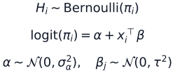

# Part II: Bayesian Hallucination Risk Modeling

Part II moves Bayesian Methods Lab from foundational regression uncertainty
toward uncertainty-aware risk modeling for language and multimodal AI systems.
This document is a scaffold only: it defines the research direction and first
modeling target without adding datasets, experiments, or new inference code.

## Research Question

Can Bayesian methods estimate the probability that an AI-generated answer is
unsupported, contradicted, or otherwise hallucinated, while also quantifying
uncertainty about that risk estimate?

The aim is not only to classify outputs as correct or hallucinated. The research
goal is to produce calibrated risk estimates that can support downstream
decisions such as abstention, retrieval escalation, human review, or answer
revision.

## Target Quantity

The first target is a conditional hallucination-risk probability:

Here `H = 1` denotes a hallucinated or unsupported answer, `q` is the prompt,
`a` is the model answer, `e` is retrieved or provided evidence, and `u` denotes
uncertainty-related features extracted from the generation and verification
pipeline.

## Bayesian Hallucination Risk Score

A Bayesian risk model should report a posterior predictive risk score rather
than a single deterministic classifier score:

This score averages over posterior uncertainty in model parameters. In later
experiments, posterior intervals around this score can be used to separate
confidently safe, confidently risky, and uncertain cases.

## Candidate Evidence Features

Initial text-only features should be simple, inspectable, and reproducible:

- retrieval similarity between the answer and supporting evidence;
- entailment or contradiction scores from a verifier model;
- answer-evidence coverage, including unsupported claims;
- generation uncertainty such as token entropy or sequence log probability;
- self-consistency disagreement across sampled answers;
- citation availability, citation overlap, or source reliability features;
- prompt type, answer length, and domain indicators;
- missing-evidence flags for questions where retrieval fails.

These features are candidates, not fixed commitments. The first implementation
should favor transparent features over large hidden representations so that
calibration and failure modes are easier to inspect.

## First Bayesian Logistic Risk Model

The first Part II model can be a Bayesian logistic regression risk model:

This model is intentionally modest. It extends the Part I logic from continuous
regression uncertainty to binary risk estimation while keeping coefficients,
posterior intervals, and calibration diagnostics interpretable.

Potential model variants for later PRs include:

- hierarchical priors by dataset, task type, or domain;
- sparse priors for selecting reliable evidence features;
- robust likelihood or label-noise extensions for imperfect hallucination
  annotations;
- Bayesian ensembles or posterior predictive mixtures over verifier features.

## Evaluation Metrics

Part II should evaluate probabilistic risk estimates, not only binary accuracy.
Candidate metrics include:

| Metric | Purpose |
| --- | --- |
| NLL / binary NLPD | Rewards calibrated probability assigned to the observed hallucination label |
| Brier score | Measures squared probability error and calibration quality |
| AUROC | Evaluates ranking of hallucinated versus non-hallucinated outputs |
| AUPRC | Focuses on positive hallucination cases when labels are imbalanced |
| Calibration curve | Visualizes predicted risk versus observed hallucination frequency |
| ECE | Summarizes expected calibration error across confidence bins |
| Risk-coverage | Measures how abstention or escalation changes residual hallucination risk |

The main claim standard should remain cautious: a model should be described as
better only when probabilistic scores, calibration, and risk-coverage evidence
support that conclusion.

## Connection To Multimodal Hallucination Uncertainty

Part II is the text-first bridge to Part III. The same target can later be
extended from language-only evidence to multimodal evidence:

- image-answer consistency for visual question answering;
- grounding between generated captions and visual regions;
- audio/video evidence alignment for temporal claims;
- modality-specific uncertainty features;
- cross-modal contradiction and missing-evidence indicators.

The long-term direction is a Bayesian risk layer that estimates when generated
outputs should be trusted, abstained, verified, or routed to human review.
