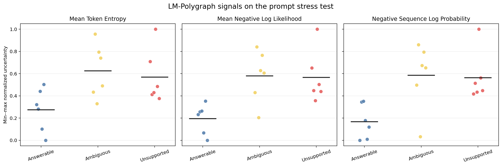
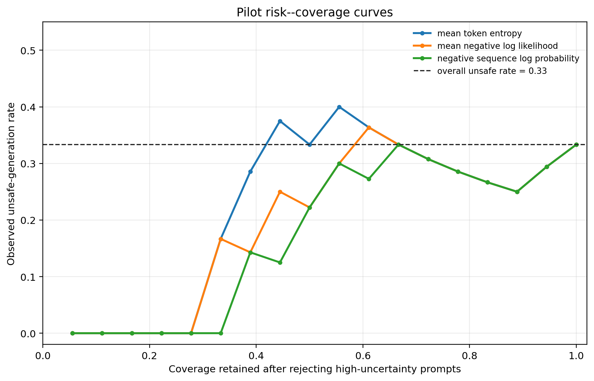

# Route 1 Pilot: Reproducing White-Box Uncertainty Signals with LM-Polygraph

## Abstract

This pilot evaluates whether three white-box uncertainty estimators implemented
in the official LM-Polygraph package respond meaningfully to answerable,
ambiguous, and unsupported questions. Eighteen transparent prompts were
evaluated with `Qwen/Qwen2.5-VL-3B-Instruct` in text-only mode under greedy
decoding. Mean token entropy and mean negative token log-likelihood separated
the deliberately stressful prompts from answerable controls, but they were much
less effective at identifying the six generations that a subsequent manual
audit classified as clearly failed or fabricated. The result supports a central
premise of this research programme: an uncertainty score is an informative but
imperfect measurement and should not be interpreted directly as a calibrated
probability of hallucination.

## Reproduction Scope

The experiment executes estimator implementations from the author-maintained
[LM-Polygraph repository](https://github.com/IINemo/lm-polygraph), associated
with the TACL 2025 benchmark paper. It is therefore an author-code reproduction
at the estimator level. It does not reproduce the paper's eleven-task,
multi-model benchmark. The other papers in this route--*Probabilities Are All
You Need*, *Semantic Volume*, and *Adaptive Bayesian Estimation of Semantic
Entropy*--were used to define the next comparison set, but an unambiguous
author-released repository for each was not located during this pass. No
paper-derived implementation is represented here as author code.

## Research Question

Do commonly used likelihood- and entropy-based signals rank deliberately
ambiguous or unsupported prompts as more uncertain than straightforward factual
prompts, and does that ranking transfer to the actual safety of the generated
answer?

The distinction between these two questions is essential. A prompt-level stress
label describes a property of the input. A generation-level safety label
describes the observed output. A model can answer an unsupported question with
a safe refusal, or it can answer with a fluent fabrication while assigning high
probability to every generated token.

## Uncertainty Estimators

Let (x) denote the input prompt, (y=(y_1,\ldots,y_T)) the generated token
sequence, (T) its length, and (\mathcal{V}) the token vocabulary. At decoding
step (t), the model defines

```math
p_t(v)
=
p\left(y_t=v\mid x,y_{<t}\right),
\qquad v\in\mathcal{V},
```

where (y_{<t}=(y_1,\ldots,y_{t-1})) is the generated prefix and (p_t(v)) is
the conditional probability assigned to candidate token (v).

Mean token entropy is

```math
\overline{H}(y\mid x)
=
\frac{1}{T}
\sum_{t=1}^{T}
\left[
-\sum_{v\in\mathcal{V}}p_t(v)\log p_t(v)
\right].
```

The inner sum is the Shannon entropy of the next-token distribution. A large
value means that probability mass is dispersed across many possible tokens.
The outer mean makes the score less directly sensitive to response length.

The package class named `Perplexity` in LM-Polygraph 0.5.0 returns mean negative
token log-likelihood rather than its exponentiated form:

```math
\mathrm{MNLL}(y\mid x)
=
-\frac{1}{T}
\sum_{t=1}^{T}
\log p_t(y_t).
```

Here (p_t(y_t)) is the probability assigned to the token that was actually
generated. Higher MNLL indicates that the generated sequence was locally less
probable on average. Conventional perplexity would be
(\exp(\mathrm{MNLL})); this report retains the exact quantity returned by the
executed library version.

Negative sequence log-probability is

```math
S(y\mid x)
=
-\sum_{t=1}^{T}
\log p_t(y_t)
=
T\,\mathrm{MNLL}(y\mid x).
```

The relationship on the right shows that this score combines average token
surprise with response length. It can therefore rank a long, otherwise ordinary
answer as more uncertain than a short answer.

## Experimental Design

The stress test contains six answerable factual questions, six deliberately
ambiguous questions, and six unsupported or false-premise questions. The binary
stress label equals zero for the answerable controls and one for the remaining
twelve prompts. It is not treated as a hallucination label.

After deterministic generation, each response was manually assigned an unsafe
generation label. The positive class was restricted to clear fabrication or
generation failure. Six outputs met that definition: one malformed response to
an answerable authorship question, one invented identity for “Jordan,” and
fabricated answers for the future Nobel Prize, a nonexistent theorem, an
unsupported WHO code, and a nonexistent DOI. Safe refusals and defensible
interpretations of ambiguous prompts were not labelled as hallucinations.

## Results

| Estimator | Stress-label AUROC | Stress-label AP | Unsafe-generation AUROC | Unsafe-generation AP |
| --- | ---: | ---: | ---: | ---: |
| Mean token entropy | 0.833 | 0.907 | 0.625 | 0.596 |
| Mean negative log-likelihood | 0.944 | 0.979 | 0.681 | 0.623 |
| Negative sequence log-probability | 0.944 | 0.979 | 0.722 | 0.646 |

The likelihood-based estimators strongly separated the constructed stress
conditions from the answerable controls. Their substantially lower AUROC against
the audited generations shows that prompt difficulty and generated factuality
are different targets. These values are descriptive results for eighteen
examples; they are not estimates of population-level performance.



The group plot shows the expected upward shift for ambiguous and unsupported
prompts. It also shows considerable within-group variation. Unsupported prompts
that elicited appropriate refusals can receive high uncertainty, while some
fabricated responses remain only moderately uncertain.

The individual generations make the failure mode concrete. The model correctly
stated that Atlantis has no capital and rejected the green-cheese premise, but
it generated specific content for the nonexistent Elara Voss theorem, assigned
a meaning to the fabricated WHO code, and produced a plausible-looking DOI for
the nonexistent paper. The DOI fabrication had mean token entropy 1.385 and
MNLL 0.574, neither of which is extreme in this pilot.

For a threshold that retains only the (n_c) lowest-uncertainty generations at
coverage (c=n_c/n), the empirical selective risk is

```math
\widehat{R}(c)
=
\frac{1}{n_c}
\sum_{i\in A_c} h_i,
```

where (n=18), (A_c) is the accepted set at coverage (c), and (h_i\in
\{0,1\}) is the manual unsafe-generation label. Lower risk at low coverage
indicates that rejecting high-uncertainty outputs is useful.



The likelihood-based rankings remove the clearly unsafe outputs from the
lowest-coverage region more effectively than mean token entropy. However, the
curves are non-monotone because the sample is small and because uncertainty is
not identical to factual error. The ranking should therefore be treated as one
input to a risk model, not as a finished decision rule.

## Interpretation

The experiment reproduces the basic operational claim that LM-Polygraph can
extract discriminative white-box uncertainty signals from an open-weight model.
It does not support the stronger claim that any one of these signals is already
a hallucination probability. In particular, an autoregressive model may be
confident about a familiar linguistic pattern used to express a fabricated
fact. Conversely, it may be uncertain while responsibly declining to answer.

This motivates the next Bayesian object. Let (H_i=1) denote that generation
(i) is hallucinated and let (z_i) collect entropy, likelihood, semantic
dispersion, evidence support, and other measurements. The intended target is

```math
r_i
=
P(H_i=1\mid z_i,x_i,m_i,d_i),
```

where (x_i) is the prompt and context, (m_i) identifies the generating
model, and (d_i) identifies the task or domain. The posterior risk (r_i)
must be learned and calibrated against outcome data. It is not interchangeable
with any component of (z_i).

## Limitations

The pilot uses one model, one deterministic decoding configuration, eighteen
hand-designed prompts, and one manual annotation pass. The default model is a
vision-language model used here only for text, and one answerable prompt
produced malformed multilingual output. The labels do not capture every form of
helpfulness, unsupported specificity, or partial correctness. No confidence
interval is meaningful at this sample size. Sampling-based semantic entropy,
semantic volume, model-internal perturbations, verbal uncertainty, and external
evidence were not yet evaluated.

## Reproduction Command

After preparing the environment described in [ENVIRONMENT.md](ENVIRONMENT.md):

```bash
HF_HUB_OFFLINE=1 TRANSFORMERS_OFFLINE=1 \
python part0_reproductions/01_uncertainty_signals/experiments/run_lm_polygraph_signal_pilot.py \
  --local-files-only
```

The run writes [raw signal scores](reports/tables/signal_scores.csv), [summary
metrics](reports/tables/signal_summary.csv), run metadata, and the figures used
in this report.
